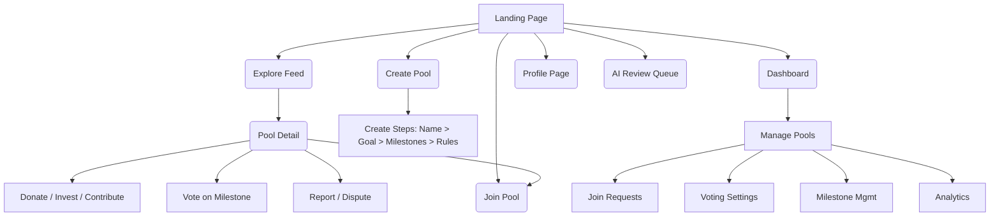
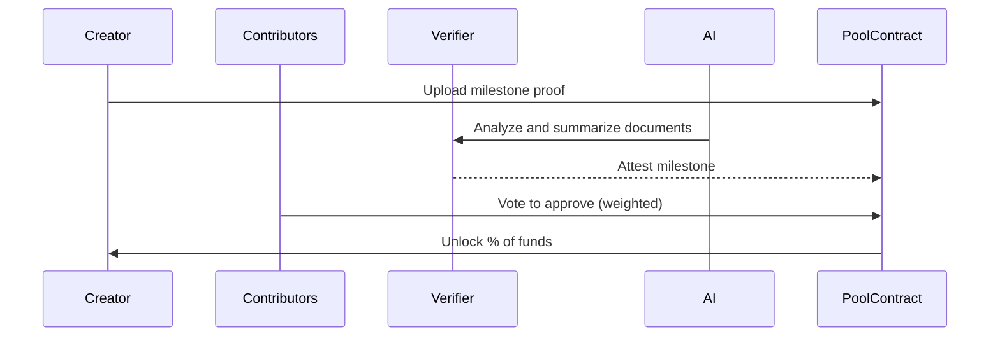

# UPool – Social Funding App

**Domain:** [UPool.fun](https://upool.fun)  
**Tagline:** Fund together. Grow together. Go further.

---

## 📘 Overview

UPool is a social, trust-based platform that allows friends, communities, and travelers to pool money toward a shared goal, grow it using DeFi yield strategies on the Base blockchain, and unlock funds based on milestone validation and voting. Users can also donate, invest, or contribute NFTs to fund pools.

---

## 🎯 Core Features

- Pool creation with milestone-based fund release
- Yield farming using Base Agent Kit while funds are pooled
- Role-based interactions: Creator, Contributor, Donor, Investor, Verifier, Moderator
- Configurable visibility: Private, Link-only, or Public
- NFT auction integration for fundraising
- Trust score and Talent Protocol integration
- Dispute resolution and AI-powered validation
- Viral sharing with short links and TikTok-style pool discovery

---

## 👤 Roles & Permissions

| Role        | Description |
|-------------|-------------|
| **Creator**     | Creates and manages pool, sets milestones, unlock rules |
| **Contributor** | Deposits funds, votes on milestone unlock and new members |
| **Donor**       | Funds specific milestones or full pool, can review proofs |
| **Investor**    | Invests in return for potential ROI on successful completion |
| **Verifier**    | Attests milestone completion |
| **Moderator**   | Handles disputes, fraud flags, and slashing |

---

## 🧭 Navigation Flow



---

## 🔄 Sequential Flow – Milestone Unlock



---

## 🧱 Architecture Overview

```mermaid
graph TD
    UI[Frontend: Next.js + Tailwind] --> API
    API[Backend: Node.js + LangChain] --> SC[Smart Contracts (Solidity)]
    SC --> Base[Base Blockchain]
    SC --> Aave[Yield Protocols]
    SC --> IPFS[Storage for Proofs, NFTs]
    UI --> Wallet[Wallet/Auth (Privy, Worldcoin)]
    UI --> Notifier[Notifications (Resend, Email, Telegram)]
    API --> AI[OpenAI, Claude for validation]
    API --> Talent[Talent Protocol Trust API]
```

---

## 🧠 AI Use Cases

- Validate milestone proof (e.g., invoice images)
- Generate descriptions and summaries for pools
- Detect anomalies or risk of fraud
- Auto-suggest milestones
- Aid moderators in disputes

---

## 💸 Monetization Strategy

- 2–5% success fee on completed pools
- 10–20% of earned yield
- 1% on investor repayments
- NFT auction commission
- Premium features for creators

---

## 🔐 Trust & Reputation

- Trust score per user (based on behavior, approvals, disputes)
- Talent Protocol integration for external Web3 identity
- Join approval voting based on % or #, weighted by deposit
- Role-specific privileges and limits

---

## 🌍 Public Feed & Sharing

- TikTok-style feed for public pools (vertical video or image-based)
- Smart share links and QR codes
- Vanity links (e.g. upool.fun/p/skytrip)
- Join with approval workflow + link-based invite

---

## 📅 Roadmap (Phases)

**MVP**
- Pool creation, contribution, milestone setup
- Yield deposit with Base Agent Kit
- Join approval and vote unlock
- Trust score and invite link

**Phase 2**
- AI validation, ROI tracking for investors
- NFT marketplace
- Explore feed + Talent Protocol trust

**Phase 3**
- Tokenization ($UPOOL)
- DAO moderation
- Staking, slashing, governance tools

---

## ✅ Final Notes

- **Brand:** UPool
- **Domain:** [UPool.fun](https://upool.fun)
- **Slogan:** Fund together. Grow together. Go further.
- **Built on:** Base blockchain, Base Agent Kit, OpenAI
