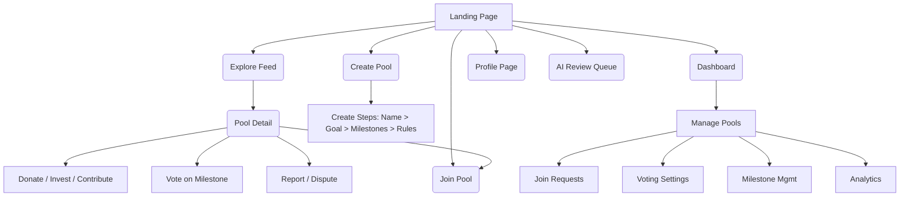
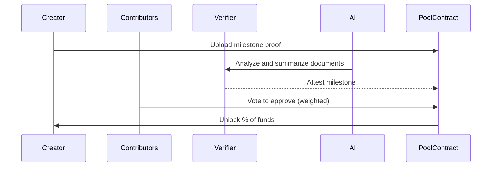
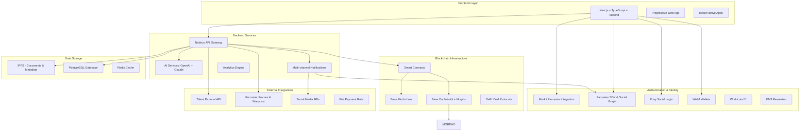

# UPool – Social Funding App

**Domain:** [UPool.fun](https://upool.fun)  
**Tagline:** Fund together. Grow together. Go further.

---

## 📘 Overview

UPool is a social, trust-based platform that allows friends, communities, and travelers to pool money toward shared goals, grow funds using Morpho lending protocol on the Base blockchain, and unlock funds based on milestone validation and voting. Each pool has its own smart wallet address with custom vanity names (e.g., upool.fun/p/skytrip), supports social login authentication, and enables users to donate, invest, or contribute NFTs through integrated auction systems.

Built as a native Farcaster Mini App using Minikit, UPool leverages the Farcaster social graph for trust-based pool discovery, viral sharing through Frames, and seamless wallet interactions within the Farcaster ecosystem.

---

## 🎯 Core Features

### 🏊 Pool Management
- Pool creation with milestone-based fund release
- Smart wallet addresses per pool with custom vanity names
- Yield generation using Morpho protocol via Base OnchainKit while funds are pooled
- Configurable visibility: Private, Link-only, or Public
- Weighted voting system for milestone approval and member joining

### 👥 Social & Trust
- Role-based interactions: Creator, Contributor, Donor, Investor, Verifier, Moderator
- Trust score combining Talent Protocol + Farcaster social graph analysis
- Native Farcaster Mini App experience via Minikit integration
- Social login integration (Privy, Worldcoin, Farcaster)
- Approval workflows with customizable thresholds
- Friend-to-friend pool discovery through Farcaster follows and connections

### 💰 Financial Features
- NFT auction integration for fundraising
- ROI tracking and distribution for investors
- Yield distribution mechanisms with platform fee structure
- Multi-asset support and flexible contribution options

### 🤖 AI & Automation
- AI-powered milestone validation and document analysis
- Risk detection and fraud prevention algorithms
- Automated copywriting and milestone suggestions
- Intelligent dispute resolution assistance

### 🌐 Discovery & Sharing
- TikTok-style public feed for pool discovery
- Native Farcaster Frames for interactive pool previews and joining
- Viral sharing through Farcaster casts with embedded pool cards
- Smart links, QR codes, and Farcaster Frame sharing
- Join-via-link with approval workflow integration
- Channel-based pool categorization within Farcaster ecosystem

---

## 👤 Roles & Permissions

| Role | Description | Key Capabilities | Trust Requirements |
|------|-------------|------------------|-------------------|
| **Creator** | Pool initiator and manager | Create pools, set milestones, upload proofs, manage settings | Medium (verified identity) |
| **Contributor** | Active pool member with voting rights | Deposit funds, vote on milestones, approve new members, withdraw yield | Low (wallet verification) |
| **Donor** | External supporter of specific milestones | Fund milestones, review proofs, provide feedback | Low (optional KYC) |
| **Investor** | ROI-focused participant | Provide capital, track returns, vote on major decisions | High (accredited status) |
| **Verifier** | Independent milestone validator | Review proofs, conduct verification, provide attestation | High (reputation + expertise) |
| **Moderator** | Dispute resolution specialist | Investigate disputes, make rulings, manage penalties | Very High (platform appointed) |

---

## 🔄 Detailed Role Processes

### 🎯 Creator Role - Complete Workflow

#### Phase 1: Pool Creation Process
1. **Identity Verification**
   - Connect Web3 wallet and complete KYC verification
   - Link social accounts (Twitter, LinkedIn, GitHub) for trust building
   - Set up ENS domain or use existing verified identity
   - Complete Talent Protocol verification for enhanced credibility

2. **Pool Setup Wizard**
   - **Basic Information**: Pool name, description, category selection
   - **Financial Goals**: Target amount, funding deadline, minimum contribution
   - **Milestone Definition**: Break goal into 3-10 measurable milestones with:
     - Clear completion criteria and success metrics
     - Required proof types (documents, images, videos, links)
     - Fund release percentage (must total 100%)
     - Estimated completion timeline
   - **Governance Rules**: Voting thresholds, approval requirements, dispute resolution preferences

3. **Pool Configuration**
   - **Visibility Settings**: Private (invite-only), Link-only, or Public
   - **Member Limits**: Maximum contributors, approval requirements
   - **Yield Strategy**: Select Morpho lending markets via Base OnchainKit integration
   - **Fee Structure**: Platform fees, creator rewards, contributor benefits
   - **Custom Vanity URL**: Reserve memorable link (e.g., upool.fun/p/eurotrip2025)

4. **Launch & Promotion**
   - Deploy smart contract with configured parameters
   - Generate shareable links and QR codes
   - Create promotional materials using AI-generated content
   - Set up notification preferences for updates

#### Phase 2: Pool Management Operations
1. **Member Management**
   - Review and approve/reject join requests
   - Manage contributor permissions and roles
   - Handle invitation distribution and tracking
   - Monitor member activity and engagement levels

2. **Milestone Execution**
   - Upload proof documents when milestones are completed
   - Provide detailed explanations and context
   - Respond to verifier questions and requests for additional information
   - Track milestone approval progress and voting status

3. **Fund Management**
   - Monitor Morpho yield generation and performance
   - Withdraw approved milestone funds
   - Distribute funds according to planned usage
   - Provide spending transparency reports to contributors

4. **Communication & Updates**
   - Send regular progress updates to all stakeholders
   - Manage pool timeline and adjust expectations
   - Handle questions and concerns from contributors
   - Coordinate with verifiers and moderators as needed

### 🤝 Contributor Role - Complete Workflow

#### Phase 1: Discovery & Evaluation
1. **Pool Discovery**
   - Browse public pools via TikTok-style discovery feed
   - Filter by category, trust score, yield potential, and completion probability
   - Access pools via shared links from friends or social media
   - Review detailed pool information and creator reputation

2. **Due Diligence Process**
   - Analyze milestone structure and feasibility
   - Review creator's track record and trust score
   - Examine existing contributor profiles and activity
   - Assess yield strategy and financial projections
   - Check dispute history and resolution outcomes

3. **Decision Framework**
   - Calculate personal investment amount based on pool goals
   - Evaluate risk/reward ratio considering yield potential
   - Assess alignment with personal values and interests
   - Consider social connections and community involvement

#### Phase 2: Joining & Contributing
1. **Join Request Process**
   - Submit join request with optional introduction message
   - Specify intended contribution amount (can be adjusted later)
   - Wait for approval from existing contributors (if required)
   - Complete any additional verification requirements

2. **Fund Contribution**
   - Connect wallet and verify sufficient balance
   - Choose contribution amount within personal limits
   - Select contribution timing (immediate or milestone-based)
   - Confirm transaction and receive pool membership tokens

3. **Initial Setup**
   - Set notification preferences for pool updates
   - Configure voting delegation if desired
   - Join pool communication channels (Discord, Telegram)
   - Review milestone schedule and upcoming votes

#### Phase 3: Active Participation
1. **Milestone Voting Process**
   - Receive notifications when milestones are submitted for approval
   - Review uploaded proof materials and creator explanations
   - Examine AI analysis summary and risk assessments
   - Consider verifier attestations and expert opinions
   - Cast weighted vote (approve/reject) with optional comments
   - Monitor voting progress and final outcomes

2. **Member Approval Voting**
   - Review new join requests and applicant information
   - Evaluate potential members based on trust scores and fit
   - Cast votes on membership applications
   - Participate in discussions about community standards

3. **Ongoing Monitoring**
   - Track pool progress and milestone completion rates
   - Monitor yield generation and personal returns
   - Stay informed about creator updates and timeline changes
   - Participate in community discussions and feedback

4. **Yield & Withdrawal Management**
   - Monitor personal yield earnings and accumulation
   - Withdraw available yield according to pool rules
   - Reinvest yield into pool or withdraw to personal wallet
   - Track total returns and investment performance

### 💝 Donor Role - Complete Workflow

#### Phase 1: Discovery & Selection
1. **Pool Exploration**
   - Browse public pools aligned with personal interests and values
   - Use filtering to find pools by cause, location, or category
   - Review pool impact metrics and social good potential
   - Assess creator credibility and community support levels

2. **Milestone Analysis**
   - Review specific milestones available for sponsorship
   - Understand milestone impact and completion requirements
   - Evaluate proof requirements and verification standards
   - Check funding gaps and community needs

#### Phase 2: Sponsorship Process
1. **Milestone Selection**
   - Choose specific milestones to sponsor (full or partial funding)
   - Set funding amount and any conditional requirements
   - Specify involvement level in milestone review process
   - Configure notification preferences for updates

2. **Funding Execution**
   - Transfer funds to milestone-specific escrow
   - Receive donor recognition and pool membership status
   - Set up milestone tracking and progress monitoring
   - Join donor communication channels if available

#### Phase 3: Milestone Oversight
1. **Progress Monitoring**
   - Receive regular updates on milestone progress
   - Access creator reports and documentation
   - Monitor community discussions and feedback
   - Track timeline adherence and potential delays

2. **Proof Review Process**
   - Receive notifications when sponsored milestones are submitted
   - Review proof materials and creator explanations
   - Examine AI analysis and verifier assessments
   - Provide donor feedback and approval/rejection decision
   - Participate in dispute resolution if needed

3. **Impact Assessment**
   - Evaluate milestone completion quality and impact
   - Provide feedback to creators and community
   - Share success stories and sponsor additional milestones
   - Build long-term relationships with successful creators

### 📈 Investor Role - Complete Workflow

#### Phase 1: Investment Analysis
1. **Market Research**
   - Analyze pool categories with highest ROI potential
   - Review historical performance data and success rates
   - Identify trending creators and high-performing pools
   - Assess market conditions and yield opportunities

2. **Due Diligence Process**
   - Conduct comprehensive creator background checks
   - Analyze business plan viability and market potential
   - Review financial projections and milestone feasibility
   - Assess team composition and execution capability
   - Evaluate competitive landscape and differentiation

3. **Risk Assessment**
   - Calculate risk-adjusted returns and probability of success
   - Analyze milestone complexity and completion likelihood
   - Review dispute history and creator track record
   - Assess market volatility and external risk factors

#### Phase 2: Investment Execution
1. **Investment Structuring**
   - Negotiate investment terms including ROI expectations
   - Set milestone-based funding releases and performance triggers
   - Define success metrics and return calculation methods
   - Establish investor rights and information access levels

2. **Capital Deployment**
   - Transfer investment funds to pool smart contract
   - Set up automated yield optimization strategies
   - Configure milestone-based release schedules
   - Establish monitoring and reporting systems

#### Phase 3: Portfolio Management
1. **Performance Monitoring**
   - Track milestone completion rates and timeline adherence
   - Monitor yield generation and ROI accumulation
   - Assess pool performance against projections
   - Review creator execution and community engagement

2. **Active Involvement**
   - Participate in major strategic decisions and votes
   - Provide guidance and mentorship to creators
   - Connect pools with relevant networks and resources
   - Facilitate partnerships and growth opportunities

3. **Return Optimization**
   - Reinvest returns into high-performing pools
   - Diversify across multiple pool categories and creators
   - Optimize Morpho lending market selection and strategies
   - Plan exit strategies and return distributions

### ✅ Verifier Role - Complete Workflow

#### Phase 1: Qualification & Selection
1. **Verifier Application Process**
   - Complete comprehensive background and expertise verification
   - Demonstrate relevant domain knowledge and experience
   - Build reputation through successful verification history
   - Undergo periodic competency assessments and training

2. **Specialization Areas**
   - Select expertise domains (travel, business, education, tech, etc.)
   - Complete domain-specific training and certification
   - Build portfolio of successful verifications
   - Maintain continuing education and skill development

#### Phase 2: Verification Assignment
1. **Case Assignment System**
   - Receive verification requests based on expertise matching
   - Review milestone details and proof requirements
   - Assess complexity and time requirements
   - Accept or decline assignments based on capacity

2. **Initial Assessment**
   - Review all submitted proof materials and documentation
   - Examine AI analysis summary and flagged concerns
   - Identify verification approach and required investigations
   - Estimate timeline and resource requirements

#### Phase 3: Verification Process
1. **Evidence Analysis**
   - Conduct thorough review of all submitted materials
   - Verify document authenticity and consistency
   - Cross-reference information with external sources
   - Identify any discrepancies or missing information

2. **Investigation & Validation**
   - Contact relevant third parties for confirmation
   - Conduct interviews or site visits if required
   - Verify timestamps, locations, and transaction details
   - Document all verification steps and findings

3. **Attestation & Reporting**
   - Prepare comprehensive verification report
   - Provide clear recommendation (approve/reject/request more info)
   - Document confidence level and any reservations
   - Submit attestation to smart contract and community

#### Phase 4: Post-Verification Support
1. **Community Communication**
   - Respond to questions from contributors and donors
   - Provide additional clarification if needed
   - Participate in dispute resolution processes
   - Maintain professional standards and transparency

2. **Continuous Improvement**
   - Gather feedback on verification quality and process
   - Update verification methods based on new best practices
   - Participate in verifier community discussions
   - Contribute to platform verification standards development

### ⚖️ Moderator Role - Complete Workflow

#### Phase 1: Dispute Intake & Triage
1. **Dispute Detection**
   - Monitor automated systems for dispute flags and reports
   - Receive direct reports from community members
   - Review AI-flagged suspicious activities and patterns
   - Prioritize cases based on severity and community impact

2. **Initial Assessment**
   - Review dispute details and supporting evidence
   - Classify dispute type (milestone, governance, fraud, harassment)
   - Assess urgency level and potential community harm
   - Assign appropriate investigation resources and timeline

#### Phase 2: Investigation Process
1. **Evidence Gathering**
   - Collect all relevant documentation and communications
   - Interview involved parties and witnesses
   - Review transaction history and smart contract interactions
   - Examine verifier reports and AI analysis summaries

2. **Stakeholder Communication**
   - Notify all affected parties of investigation process
   - Establish communication protocols and timelines
   - Provide regular updates on investigation progress
   - Facilitate mediation sessions if appropriate

#### Phase 3: Resolution & Implementation
1. **Decision Making**
   - Analyze all evidence and stakeholder input
   - Consult with other moderators and experts as needed
   - Determine appropriate resolution and penalties
   - Document decision rationale and precedent implications

2. **Resolution Implementation**
   - Execute smart contract actions (fund redistribution, account restrictions)
   - Update user trust scores and reputation records
   - Communicate decisions to all affected parties
   - Implement monitoring for compliance and follow-up

3. **Community Communication**
   - Publish resolution summary (maintaining privacy as appropriate)
   - Update community guidelines and precedents
   - Conduct educational outreach to prevent similar issues
   - Gather community feedback on resolution effectiveness

#### Phase 4: System Improvement
1. **Pattern Analysis**
   - Identify recurring dispute types and root causes
   - Analyze effectiveness of current resolution mechanisms
   - Recommend platform improvements and policy updates
   - Contribute to AI training data and detection algorithms

2. **Community Development**
   - Mentor new moderators and verifiers
   - Contribute to dispute resolution best practices
   - Participate in governance discussions and policy development
   - Build relationships with external experts and organizations

---

## 🧭 Navigation Flow

---

## 🔄 Sequential Flow – Milestone Unlock

---

## 🧱 Architecture Overview

---

## 🧠 AI Use Cases

### 🔍 Document Analysis
- Validate milestone proof documents (invoices, receipts, images)
- Extract key data from uploaded documents
- Verify document authenticity and detect deepfakes
- Generate structured summaries of proof materials

### 🛡️ Risk & Fraud Detection
- Detect anomalies in pool activity and user behavior
- Identify potential fraud patterns and suspicious transactions
- Monitor for coordinated manipulation attempts
- Assess pool completion probability based on historical data

### ✍️ Content Generation
- Auto-suggest milestones based on pool goals and category
- Generate compelling pool descriptions and marketing copy
- Create personalized notification messages
- Draft dispute resolution recommendations

### 🤝 Moderation Assistance
- Aid moderators in dispute investigation and resolution
- Provide context-aware recommendations for complex cases
- Automate routine moderation tasks and flagging
- Generate explanation summaries for community understanding

---

## 💸 Monetization Strategy

### 💰 Revenue Streams
- **Success Fees**: 2–5% fee on successfully completed pools
- **Yield Share**: 10–20% of earned DeFi yield from pooled funds
- **Investment Returns**: 1% fee on investor ROI distributions
- **NFT Marketplace**: 2.5% commission on NFT auctions and sales
- **Premium Subscriptions**: Advanced analytics, priority support, custom branding

### 🎯 Pricing Tiers
- **Basic (Free)**: Standard pool creation, basic analytics, community support
- **Creator ($9.99/month)**: Advanced pool customization, detailed analytics, priority listing
- **Enterprise ($49.99/month)**: White-label solutions, custom integrations, dedicated support

### 📈 Revenue Projections
- **Year 1**: Focus on user acquisition, minimal fees
- **Year 2**: Implement full fee structure, target $1M ARR
- **Year 3**: Premium features rollout, target $5M ARR

---

## 🔐 Trust & Reputation

### 📊 Trust Scoring System
- Dynamic trust score per user based on:
  - Pool completion history and milestone success rate
  - Community voting participation and quality
  - Dispute involvement and resolution outcomes
  - Time-weighted contribution consistency
  - Cross-verification from other trusted users

### 🌐 External Identity Integration
- **Talent Protocol**: Web3 identity verification and reputation import
- **ENS Integration**: Domain-based identity display and verification
- **Social Login**: Seamless onboarding with existing social accounts
- **Multi-wallet Support**: Link multiple wallets to single identity

### 🗳️ Governance & Approval Systems
- **Weighted Voting**: Vote power based on contribution amount and trust score
- **Flexible Thresholds**: Creator-configurable approval requirements (% or absolute numbers)
- **Time-based Voting**: Configurable voting windows with automatic execution
- **Delegation Support**: Allow trusted members to vote on behalf of others

### 🔒 Role-Based Security
- Role-specific privileges and spending limits
- Multi-signature requirements for large transactions
- Emergency pause mechanisms for suspicious activity
- Graduated access levels based on trust score progression

---

## 🌍 Public Feed & Sharing

### 📱 Discovery Feed
- **TikTok-Style Interface**: Vertical scrolling feed with engaging visuals
- **Pool Cards**: Rich preview cards with progress, yield, and member info
- **Category Filtering**: Browse by pool type (travel, startup, community, etc.)
- **Trending Algorithm**: Surface popular and high-performing pools
- **Personalized Recommendations**: AI-powered suggestions based on user interests

### 🔗 Viral Sharing Mechanics
- **Smart Share Links**: Dynamic links with embedded pool previews
- **QR Code Generation**: Easy sharing for in-person invitations
- **Vanity URLs**: Custom memorable links (e.g., upool.fun/p/skytrip)
- **Social Media Integration**: Optimized sharing for Twitter, Discord, Telegram
- **Referral Tracking**: Track and reward successful referrals

### 🚪 Join & Invitation System
- **Link-Based Invites**: One-click join via shared links
- **Approval Workflows**: Customizable member approval processes
- **Invitation Limits**: Creator-controlled invitation quotas
- **Guest Preview**: Allow non-members to view pool details
- **Waiting Lists**: Queue system for popular pools with limited spots

---

## 📅 Roadmap (Phases)

### 🚀 Phase 1: MVP (Q1-Q2 2025)
**Core Platform Foundation**
- ✅ Smart contract architecture design
- ✅ Frontend application setup
- 🔄 Minikit integration for Farcaster Mini App experience
- 🔄 Basic Farcaster Frames for pool sharing and discovery
- 🔄 Pool creation and milestone system
- 🔄 Basic yield farming with Morpho via Base OnchainKit
- 🔄 User authentication with Farcaster + wallet integration
- 🔄 Simple voting and approval mechanisms
- 🔄 Trust score calculation framework with social graph
- 🔄 Invite link generation and Farcaster Frame sharing

### 🎯 Phase 2: Enhanced Features (Q3-Q4 2025)
**AI Integration & Advanced Social Features**
- AI-powered milestone validation system
- Advanced Farcaster Frames with voting and milestone tracking
- ROI tracking and investor dashboard
- NFT marketplace and auction integration
- Enhanced public pool discovery feed with social graph recommendations
- Deep Farcaster social graph analysis for trust scoring
- Talent Protocol integration with Farcaster identity
- Advanced analytics and reporting with social metrics
- Channel-based pool communities within Farcaster
- Multi-language support (EN/ES)

### 🏛️ Phase 3: Governance & Scaling (Q1-Q2 2026)
**Decentralization & Growth**
- $UPOOL governance token launch
- DAO-based moderation system
- Staking mechanisms and yield boosting
- Slashing for malicious behavior
- Cross-chain expansion (Ethereum, Polygon)
- Enterprise partnership program
- Advanced dispute resolution protocols
- Institutional investor features

### 🌍 Phase 4: Global Expansion (Q3-Q4 2026)
**Mass Adoption & Innovation**
- Mobile native applications (iOS/Android)
- Global compliance and regulatory frameworks
- Fiat on/off ramps integration
- AI-powered pool success prediction
- Social media platform integrations
- Corporate team funding solutions
- Educational content and certification programs
- Community-driven feature development

---

## 🎨 Brand Identity

### 🏷️ Brand Elements
- **Name**: UPool
- **Domain**: [UPool.fun](https://upool.fun)
- **Tagline**: Fund together. Grow together. Go further.
- **Mission**: Making collaborative funding accessible, transparent, and rewarding
- **Vision**: Empowering communities to achieve shared dreams through trust and technology

### 🎯 Target Audiences
- **Primary**: Friends and small communities (5-50 people) funding shared experiences
- **Secondary**: Startup teams raising pre-seed funding
- **Tertiary**: Content creators and influencers building community projects
- **Enterprise**: Corporate teams funding innovation initiatives

### 🛠️ Technology Stack
- **Blockchain**: Base (Ethereum L2) for low fees and fast transactions
- **Yield Generation**: Morpho Protocol via Base OnchainKit for automated lending strategies
- **Social Layer**: Minikit + Farcaster SDK for native social integration and Frames
- **AI Services**: OpenAI GPT-4 and Claude for validation and content generation
- **Frontend**: Next.js with TypeScript and Tailwind CSS
- **Authentication**: Minikit (Farcaster), Privy, and Worldcoin for comprehensive login options
- **Storage**: IPFS for decentralized document and metadata storage
- **Notifications**: Multi-channel system (email, SMS, push, Telegram, Farcaster casts)

### 🏆 Competitive Advantages
- **Native Farcaster Integration**: First-party social funding experience within Farcaster ecosystem
- **Social-First Design**: Built for real relationships and trust networks enhanced by social graph
- **Minikit Seamless UX**: Frictionless wallet interactions without leaving Farcaster clients
- **Viral Farcaster Frames**: Interactive pool sharing and joining directly in feeds
- **Yield Generation**: Funds grow while waiting for milestones
- **AI-Powered Validation**: Reduces friction in milestone verification
- **Flexible Roles**: Supports various funding models (donation, investment, contribution)
- **Base Integration**: Benefits from Coinbase ecosystem and low transaction costs
