# UPool - Social Funding Platform 🌊

**Fund together. Grow together. Go further.**

UPool is a revolutionary social funding platform built on the Base blockchain that enables friends, communities, and travelers to pool money toward shared goals, earn yield through DeFi strategies, and unlock funds based on milestone validation and community voting.

---

## 🌟 Vision

UPool transforms how communities fund their dreams by combining:
- **Social Trust** - Reputation-based interactions between real people
- **Smart Finance** - Automated yield generation on pooled funds
- **Milestone Accountability** - Progressive fund release based on verified achievements
- **Democratic Governance** - Community-driven decision making

---

## 🏗️ System Architecture

### High-Level Architecture

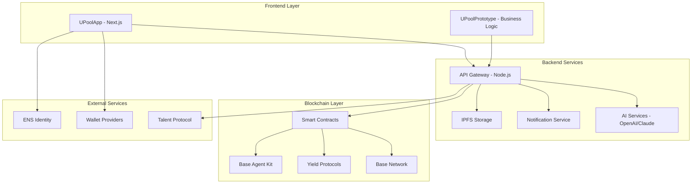

### Component Architecture

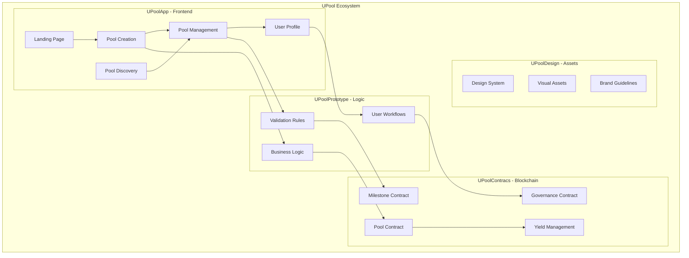

### Data Flow Architecture

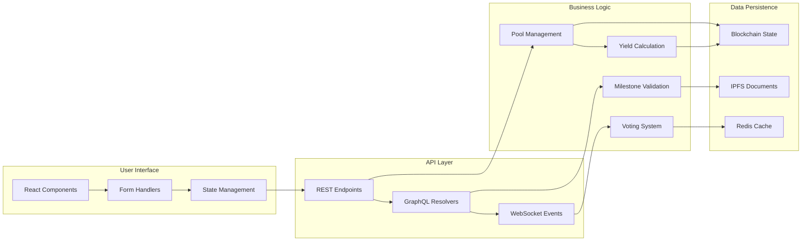

---

## 👥 User Roles & Sequential Diagrams

### Creator Role - Pool Creation & Management

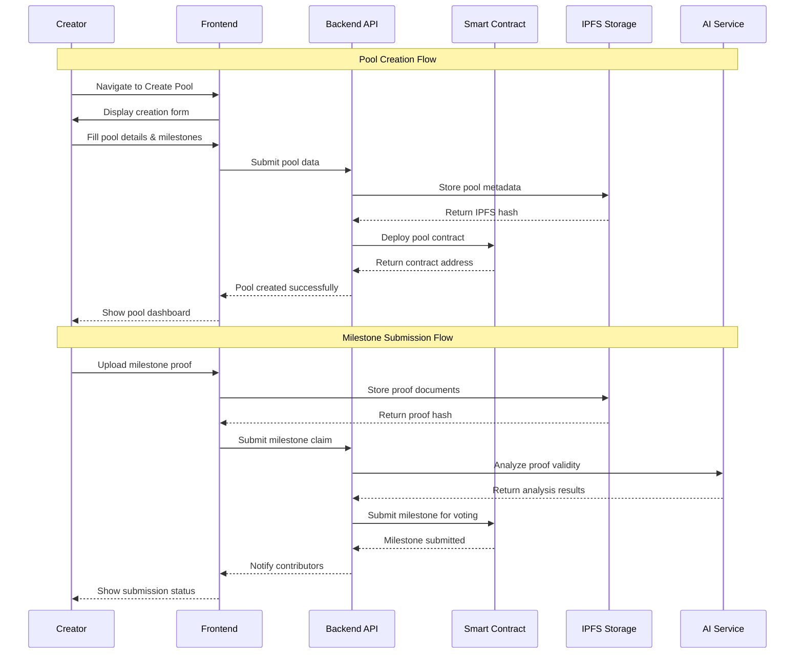

### Contributor Role - Funding & Voting

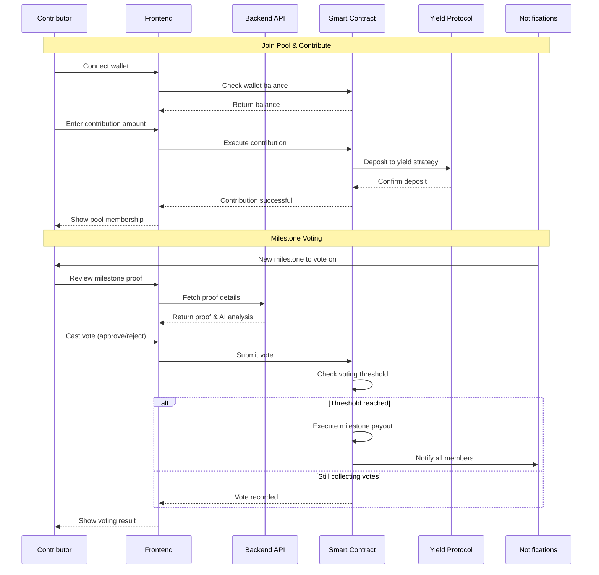

### Donor Role - Milestone Sponsorship

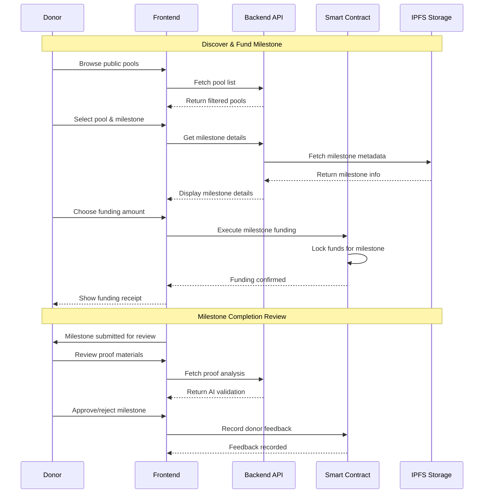

### Investor Role - ROI-Based Funding

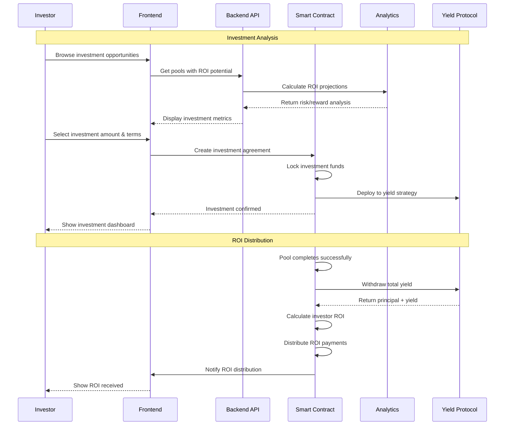

### Verifier Role - Milestone Validation

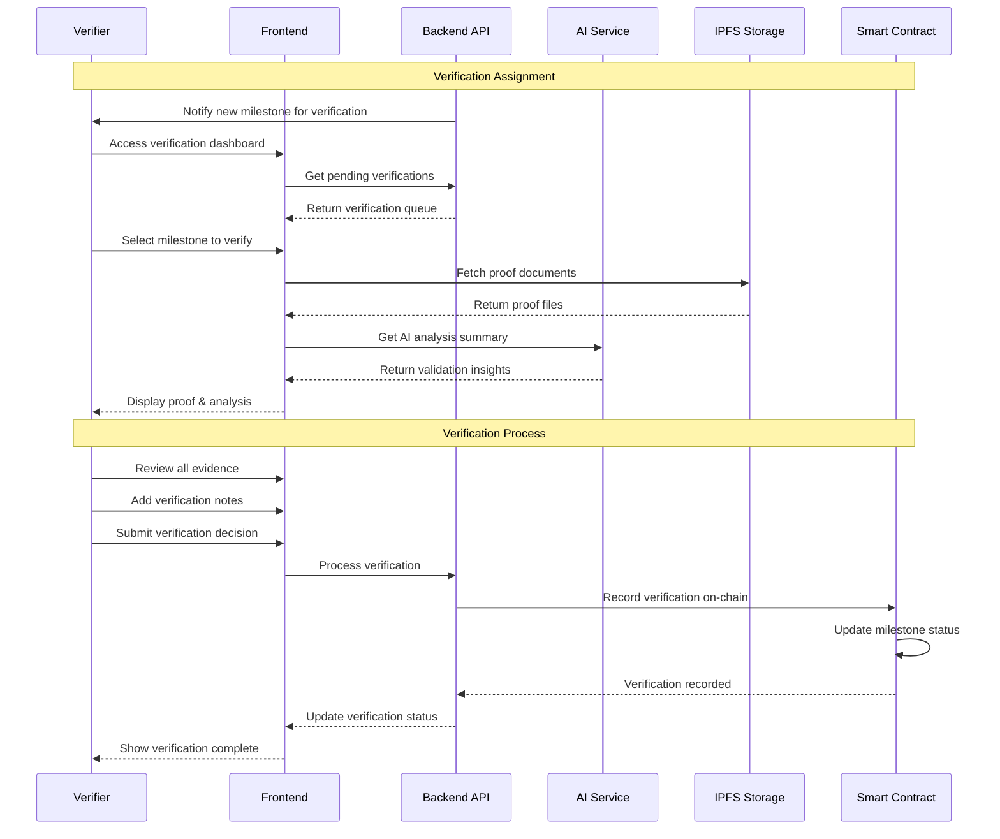

### Moderator Role - Dispute Resolution

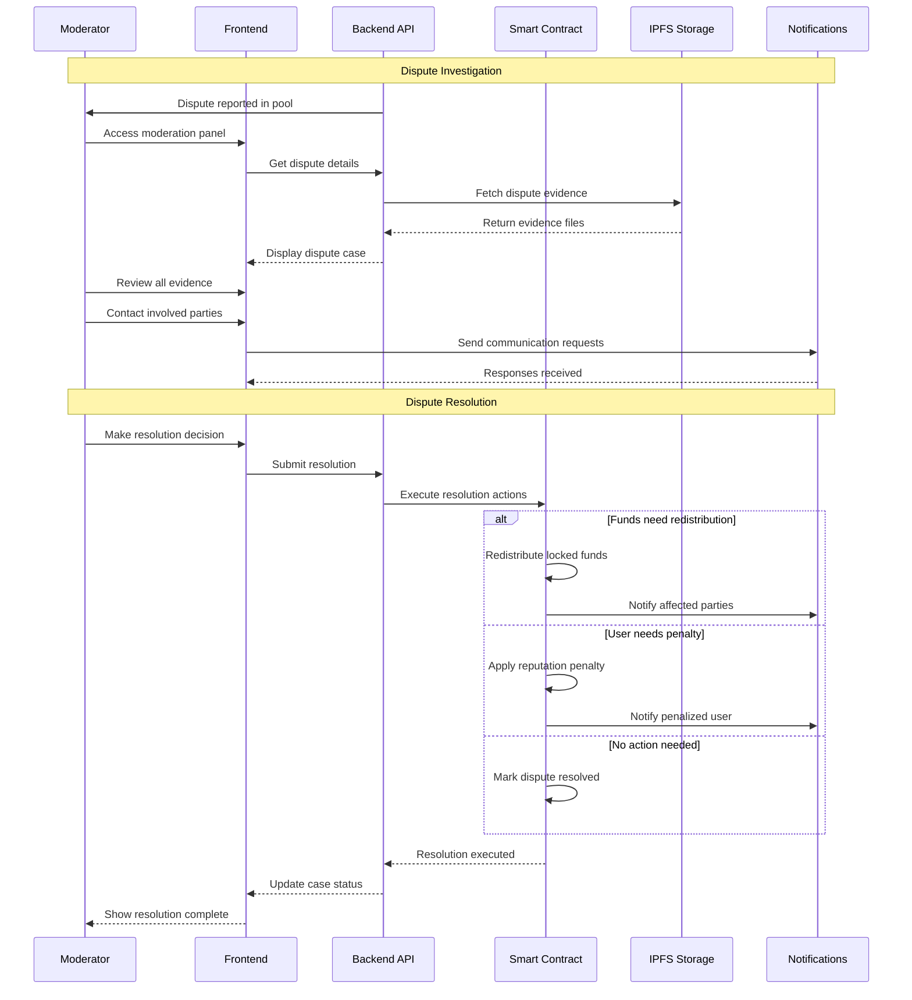

---

## 🔄 Core System Flows

### End-to-End Pool Lifecycle

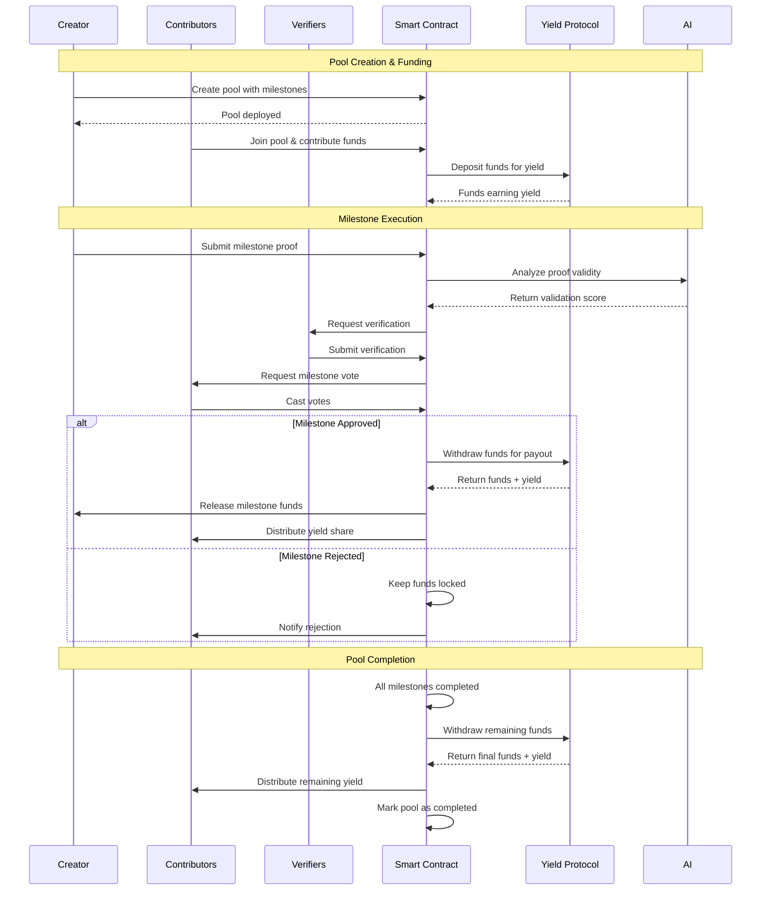

### Multi-Role Interaction Flow

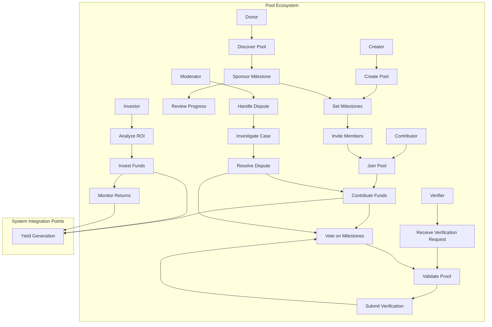

---

## 📁 Repository Structure

```
UPool/
├── 📱 UPoolApp/              # Main Next.js frontend application
│   ├── app/                  # Next.js 13+ app router pages
│   ├── components/           # React components
│   ├── hooks/               # Custom React hooks
│   ├── lib/                 # Utility functions
│   └── styles/              # Global styles and Tailwind CSS
│
├── 🧪 UPoolPrototype/        # Business logic prototype & reference
│   ├── app/                 # Prototype pages with business logic
│   ├── components/          # Business logic components
│   └── lib/                 # Core business logic utilities
│
├── 📜 UPoolContracs/         # Smart contracts (Solidity)
│   ├── contracts/           # Smart contract source files
│   ├── scripts/             # Deployment scripts
│   ├── test/               # Contract test suites
│   └── artifacts/          # Compiled contract artifacts
│
├── 🎨 UPoolDesign/           # Design system & assets
│   ├── components/          # Design system components
│   ├── tokens/             # Design tokens (colors, fonts, spacing)
│   ├── assets/             # Images, icons, illustrations
│   └── guidelines/         # Brand and usage guidelines
│
├── 📋 Project_Overview.md    # Comprehensive project documentation
├── 📋 CLAUDE.md             # AI assistant development guide
└── 📋 README.md             # This file - project overview
```

---

## 🚀 Quick Start

### Prerequisites
- Node.js 18+
- Git
- Web3 wallet (MetaMask recommended)

### Setup Instructions

1. **Clone the repository**
   ```bash
   git clone <repository-url>
   cd UPool
   ```

2. **Set up the frontend application**
   ```bash
   cd UPoolApp
   npm install
   npm run dev
   ```

3. **Access the application**
   Open [http://localhost:3000](http://localhost:3000)

4. **Explore the prototype** (optional)
   ```bash
   cd ../UPoolPrototype
   npm install
   npm run dev
   ```

---

## 🎯 Key Features

### 🏊 Pool Management
- **Create Pools**: Multi-step wizard for setting up funding goals
- **Milestone System**: Progressive fund release based on achievements
- **Role-Based Access**: Different permissions for each user type
- **Yield Generation**: Automated DeFi strategies on pooled funds

### 🤝 Social Features  
- **Trust Scoring**: Reputation system for reliable interactions
- **Community Voting**: Democratic decision-making process
- **Viral Sharing**: Smart links and QR codes for easy sharing
- **Discovery Feed**: TikTok-style exploration of public pools

### 🔐 Security & Trust
- **Blockchain Security**: Base network smart contracts
- **Identity Verification**: ENS and Talent Protocol integration  
- **AI Validation**: Automated proof verification system
- **Dispute Resolution**: Community-driven conflict resolution

### 💰 Financial Features
- **Multi-Asset Support**: Various cryptocurrency and token support
- **Yield Optimization**: Base Agent Kit for maximum returns
- **Flexible Funding**: Multiple ways to contribute (donate, invest, contribute)
- **Transparent Accounting**: On-chain fund tracking and distribution

---

## 🛠️ Technology Stack

### Frontend
- **Framework**: Next.js 15+ with App Router
- **Language**: TypeScript
- **Styling**: Tailwind CSS + shadcn/ui
- **State**: React hooks + Context API

### Blockchain  
- **Network**: Base (Ethereum L2)
- **Contracts**: Solidity smart contracts
- **Yield**: Base Agent Kit + DeFi protocols
- **Storage**: IPFS for documents and metadata

### Backend Services
- **API**: Node.js with Express/Fastify
- **AI**: OpenAI GPT-4 + Claude for validation
- **Database**: PostgreSQL + Redis cache
- **Notifications**: Email, SMS, push notifications

---

## 🏗️ Development Workflow

### Getting Started
1. Review [Project_Overview.md](./Project_Overview.md) for detailed specifications
2. Check [CLAUDE.md](./CLAUDE.md) for AI assistant development guide
3. Explore [UPoolApp/README.md](./UPoolApp/README.md) for frontend setup
4. Reference [UPoolPrototype/](./UPoolPrototype/) for business logic examples

### Development Process
1. **Planning**: Create issues and discuss features
2. **Development**: Work in feature branches
3. **Testing**: Ensure all tests pass
4. **Review**: Code review and approval process
5. **Deployment**: Automated CI/CD pipeline

---

## 📈 Roadmap

### Phase 1: MVP (Current)
- [x] Project architecture and setup
- [x] Frontend application foundation
- [x] Core UI components and design system
- [ ] Smart contract development
- [ ] Basic pool creation and management
- [ ] Wallet integration

### Phase 2: Core Features
- [ ] Milestone system implementation
- [ ] Yield farming integration
- [ ] Voting mechanisms
- [ ] AI validation system
- [ ] Trust scoring

### Phase 3: Advanced Features
- [ ] NFT integration
- [ ] Advanced analytics
- [ ] Mobile application
- [ ] Governance token ($UPOOL)
- [ ] DAO structure

### Phase 4: Scale & Optimize
- [ ] Multi-chain support
- [ ] Enterprise features
- [ ] Advanced AI features
- [ ] Institutional partnerships

---

## 🤝 Contributing

We welcome contributions! Please see our contributing guidelines:

1. **Fork** the repository
2. **Create** a feature branch (`git checkout -b feature/amazing-feature`)
3. **Commit** your changes (`git commit -m 'Add amazing feature'`)
4. **Push** to the branch (`git push origin feature/amazing-feature`)
5. **Open** a Pull Request

### Development Guidelines
- Follow TypeScript best practices
- Use conventional commit messages
- Ensure all tests pass
- Update documentation as needed

---

## 📄 License

This project is licensed under the MIT License - see the [LICENSE](LICENSE) file for details.

---

## 🔗 Links & Resources

- **Website**: [UPool.fun](https://upool.fun) (coming soon)
- **Documentation**: [Project Overview](./Project_Overview.md)
- **Frontend App**: [UPoolApp](./UPoolApp/)
- **Prototype**: [UPoolPrototype](./UPoolPrototype/)
- **Design System**: [UPoolDesign](./UPoolDesign/)
- **Smart Contracts**: [UPoolContracs](./UPoolContracs/)

---

## 📞 Support & Community

- **GitHub Issues**: Bug reports and feature requests
- **Discord**: Community discussion (coming soon)
- **Twitter**: [@UPoolFun](https://twitter.com/UPoolFun) (coming soon)
- **Email**: hello@upool.fun (coming soon)

---

**Built with ❤️ by the UPool community**

*Making collaborative funding accessible, transparent, and rewarding for everyone.*