# UPool - Social Funding Platform 🌊

**Fund together. Grow together. Go further.**

UPool is a revolutionary social funding platform built on the Base blockchain that enables friends, communities, and travelers to pool money toward shared goals, earn yield through DeFi strategies, and unlock funds based on milestone validation and community voting.

Built as a native Farcaster Mini App using Minikit, UPool leverages the Farcaster social graph for trust-based pool discovery, viral sharing through Frames, and seamless wallet interactions within the Farcaster ecosystem.

---

## 🌟 Vision

UPool transforms how communities fund their dreams by combining:
- **Native Social Integration** - Built directly into the Farcaster ecosystem for seamless social experiences
- **Social Trust** - Reputation-based interactions enhanced by Farcaster social graph analysis
- **Smart Finance** - Automated yield generation on pooled funds via Morpho Protocol
- **Milestone Accountability** - Progressive fund release based on verified achievements
- **Democratic Governance** - Community-driven decision making with weighted voting
- **Viral Distribution** - Interactive Farcaster Frames for pool sharing and discovery

---

## 🏗️ System Architecture

### High-Level Architecture


### Component Architecture


### Data Flow Architecture


---

## 👥 User Roles & Sequential Diagrams

### Creator Role - Pool Creation & Management


### Contributor Role - Funding & Voting


### Donor Role - Milestone Sponsorship


### Investor Role - ROI-Based Funding


### Verifier Role - Milestone Validation


### Moderator Role - Dispute Resolution


---

## 🔄 Core System Flows

### End-to-End Pool Lifecycle


### Comprehensive Role Interaction Flow

```mermaid
graph TB
    subgraph "Creator Ecosystem"
        CREATOR[👤 Creator]
        CREATE_POOL[🏊 Create Pool]
        SETUP_MILESTONES[🎯 Setup Milestones]
        MANAGE_MEMBERS[👥 Manage Members]  
        UPLOAD_PROOF[📋 Upload Proof]
        FUND_MGMT[💰 Fund Management]
        
        CREATOR --> CREATE_POOL
        CREATE_POOL --> SETUP_MILESTONES
        SETUP_MILESTONES --> MANAGE_MEMBERS
        MANAGE_MEMBERS --> UPLOAD_PROOF
        UPLOAD_PROOF --> FUND_MGMT
    end
    
    subgraph "Contributor Ecosystem"
        CONTRIBUTOR[🤝 Contributor]
        DISCOVERY[🔍 Pool Discovery]
        DUE_DILIGENCE[📊 Due Diligence]
        JOIN_CONTRIBUTE[💵 Join & Contribute]
        MILESTONE_VOTE[🗳️ Milestone Voting]
        MEMBER_APPROVAL[✅ Member Approval]
        YIELD_MGMT[📈 Yield Management]
        
        CONTRIBUTOR --> DISCOVERY
        DISCOVERY --> DUE_DILIGENCE
        DUE_DILIGENCE --> JOIN_CONTRIBUTE
        JOIN_CONTRIBUTE --> MILESTONE_VOTE
        MILESTONE_VOTE --> MEMBER_APPROVAL
        MEMBER_APPROVAL --> YIELD_MGMT
    end
    
    subgraph "Donor Ecosystem"
        DONOR[💝 Donor]
        EXPLORE_POOLS[🌐 Explore Pools]
        MILESTONE_ANALYSIS[📋 Milestone Analysis]
        SPONSOR_MILESTONE[🎁 Sponsor Milestone]
        MONITOR_PROGRESS[👁️ Monitor Progress]
        IMPACT_REVIEW[📈 Impact Assessment]
        
        DONOR --> EXPLORE_POOLS
        EXPLORE_POOLS --> MILESTONE_ANALYSIS
        MILESTONE_ANALYSIS --> SPONSOR_MILESTONE
        SPONSOR_MILESTONE --> MONITOR_PROGRESS
        MONITOR_PROGRESS --> IMPACT_REVIEW
    end
    
    subgraph "Investor Ecosystem"
        INVESTOR[📈 Investor]
        MARKET_RESEARCH[📊 Market Research]
        INVESTMENT_ANALYSIS[🔬 Investment Analysis]
        PORTFOLIO_MGMT[📋 Portfolio Management]
        ROI_OPTIMIZATION[💎 ROI Optimization]
        
        INVESTOR --> MARKET_RESEARCH
        MARKET_RESEARCH --> INVESTMENT_ANALYSIS
        INVESTMENT_ANALYSIS --> PORTFOLIO_MGMT
        PORTFOLIO_MGMT --> ROI_OPTIMIZATION
    end
    
    subgraph "Verifier Ecosystem"
        VERIFIER[✅ Verifier]
        QUALIFICATION[🎓 Qualification]
        CASE_ASSIGNMENT[📝 Case Assignment]
        EVIDENCE_ANALYSIS[🔍 Evidence Analysis]
        VERIFICATION_REPORT[📄 Verification Report]
        COMMUNITY_SUPPORT[🤝 Community Support]
        
        VERIFIER --> QUALIFICATION
        QUALIFICATION --> CASE_ASSIGNMENT
        CASE_ASSIGNMENT --> EVIDENCE_ANALYSIS
        EVIDENCE_ANALYSIS --> VERIFICATION_REPORT
        VERIFICATION_REPORT --> COMMUNITY_SUPPORT
    end
    
    subgraph "Moderator Ecosystem"
        MODERATOR[⚖️ Moderator]
        DISPUTE_TRIAGE[🚨 Dispute Triage]
        INVESTIGATION[🔍 Investigation]
        RESOLUTION[⚖️ Resolution]
        SYSTEM_IMPROVEMENT[⚡ System Improvement]
        
        MODERATOR --> DISPUTE_TRIAGE
        DISPUTE_TRIAGE --> INVESTIGATION
        INVESTIGATION --> RESOLUTION
        RESOLUTION --> SYSTEM_IMPROVEMENT
    end
    
    subgraph "Cross-Role Integration Points"
        YIELD_GENERATION[💹 Yield Generation]
        AI_VALIDATION[🤖 AI Validation]
        SMART_CONTRACTS[📜 Smart Contracts]
        TRUST_SCORING[🏆 Trust Scoring]
        NOTIFICATIONS[🔔 Notifications]
    end
    
    %% Cross-role connections
    MANAGE_MEMBERS -.-> JOIN_CONTRIBUTE
    UPLOAD_PROOF -.-> EVIDENCE_ANALYSIS
    MILESTONE_VOTE -.-> VERIFICATION_REPORT
    SPONSOR_MILESTONE -.-> SETUP_MILESTONES
    INVESTMENT_ANALYSIS -.-> PORTFOLIO_MGMT
    RESOLUTION -.-> FUND_MGMT
    
    %% System integration connections
    JOIN_CONTRIBUTE --> YIELD_GENERATION
    FUND_MGMT --> YIELD_GENERATION
    UPLOAD_PROOF --> AI_VALIDATION
    EVIDENCE_ANALYSIS --> AI_VALIDATION
    MILESTONE_VOTE --> SMART_CONTRACTS
    VERIFICATION_REPORT --> SMART_CONTRACTS
    COMMUNITY_SUPPORT --> TRUST_SCORING
    RESOLUTION --> TRUST_SCORING
    SYSTEM_IMPROVEMENT --> NOTIFICATIONS
```



---

## 📁 Repository Structure

```
UPool/
├── 📱 UPoolApp/              # Main Next.js frontend application
│   ├── app/                  # Next.js 13+ app router pages
│   ├── components/           # React components
│   ├── hooks/               # Custom React hooks
│   ├── lib/                 # Utility functions
│   └── styles/              # Global styles and Tailwind CSS
│
├── 🧪 UPoolPrototype/        # Business logic prototype & reference
│   ├── app/                 # Prototype pages with business logic
│   ├── components/          # Business logic components
│   └── lib/                 # Core business logic utilities
│
├── 📜 UPoolContracs/         # Smart contracts (Solidity)
│   ├── contracts/           # Smart contract source files
│   ├── scripts/             # Deployment scripts
│   ├── test/               # Contract test suites
│   └── artifacts/          # Compiled contract artifacts
│
├── 🎨 UPoolDesign/           # Design system & assets
│   ├── components/          # Design system components
│   ├── tokens/             # Design tokens (colors, fonts, spacing)
│   ├── assets/             # Images, icons, illustrations
│   └── guidelines/         # Brand and usage guidelines
│
├── 📋 Project_Overview.md    # Comprehensive project documentation
├── 📋 CLAUDE.md             # AI assistant development guide
└── 📋 README.md             # This file - project overview
```

---

## 🚀 Quick Start

### Prerequisites
- Node.js 18+
- Git
- Web3 wallet (MetaMask recommended)

### Setup Instructions

1. **Clone the repository**
   ```bash
   git clone <repository-url>
   cd UPool
   ```

2. **Set up the frontend application**
   ```bash
   cd UPoolApp
   npm install
   npm run dev
   ```

3. **Access the application**
   Open [http://localhost:3000](http://localhost:3000)

4. **Explore the prototype** (optional)
   ```bash
   cd ../UPoolPrototype
   npm install
   npm run dev
   ```

---

## 🎯 Key Features

### 🏊 Pool Management
- **Smart Pool Creation**: Multi-step wizard with AI-assisted milestone suggestions
- **Vanity URLs**: Custom memorable links (e.g., upool.fun/p/eurotrip2025)
- **Progressive Fund Release**: Milestone-based unlocking with weighted community voting
- **Flexible Governance**: Configurable approval thresholds and voting mechanisms
- **AI-Optimized Yield Generation**: Base Agent Kit AI optimizes Morpho Protocol lending strategies

### 🤝 Social & Trust Features  
- **Native Farcaster Integration**: Built-in Mini App experience with seamless wallet interactions
- **Social Graph Analysis**: Trust scoring enhanced by Farcaster follows and social connections
- **Viral Sharing**: Interactive Farcaster Frames for pool discovery and joining
- **Multi-Layered Trust Scoring**: Combines behavior, completion history, and Farcaster social graph
- **Social Login Integration**: Minikit (Farcaster), Privy, and Worldcoin ID
- **Talent Protocol Integration**: Web3 identity verification and reputation import
- **Democratic Governance**: Weighted voting based on contribution and trust scores
- **Community-Driven Moderation**: Dispute resolution with AI assistance

### 🔐 Security & Verification
- **Multi-Signature Security**: Enhanced protection for large transactions
- **Professional Verifier Network**: Expert validation for milestone completion
- **AI-Powered Fraud Detection**: Automated risk assessment and anomaly detection
- **Comprehensive KYC/AML**: Tiered verification based on role and transaction volume
- **Blockchain Immutability**: All critical actions recorded on Base network

### 💰 Advanced Financial Features
- **Multi-Role Funding**: Support for Contributors, Donors, and Investors with different ROI models
- **Yield Distribution**: Automated sharing of DeFi returns among stakeholders
- **Milestone-Specific Sponsorship**: Donors can fund individual milestones
- **ROI Tracking**: Comprehensive analytics for investor returns and performance
- **Emergency Fund Protection**: Dispute resolution mechanisms with fund recovery

### 🤖 AI & Automation
- **Document Analysis**: Automated validation of milestone proof materials
- **Content Generation**: AI-assisted pool descriptions and milestone suggestions
- **Risk Assessment**: Intelligent evaluation of pool completion probability
- **Personalized Discovery**: AI-powered recommendations based on user interests and history
- **Automated Moderation**: Proactive detection of policy violations and suspicious activity

### 🌐 Discovery & Engagement
- **Native Farcaster Experience**: Mini App built directly into Farcaster clients
- **Interactive Frames**: Rich pool previews and joining directly in Farcaster feeds
- **TikTok-Style Feed**: Vertical scrolling discovery with engaging pool previews
- **Social Graph Discovery**: Pool recommendations based on Farcaster connections
- **Viral Sharing Mechanics**: Farcaster Frames, QR codes, smart links, and cast embedding
- **Category-Based Discovery**: Advanced filtering by pool type, location, and success rate
- **Real-Time Notifications**: Multi-channel alerts including Farcaster casts
- **Community Building**: Channel-based pool communities within Farcaster ecosystem

---

## 🛠️ Technology Stack

### Frontend
- **Framework**: Next.js 15+ with App Router
- **Language**: TypeScript
- **Styling**: Tailwind CSS + shadcn/ui
- **State**: React hooks + Context API

### Blockchain  
- **Network**: Base (Ethereum L2)
- **Contracts**: Solidity smart contracts
- **Yield**: Base Agent Kit AI + Morpho Protocol + Base OnchainKit
- **Social Layer**: Minikit + Farcaster SDK for native social integration
- **Storage**: IPFS for documents and metadata

### Backend Services
- **API**: Node.js with Express/Fastify
- **AI**: OpenAI GPT-4 + Claude for validation
- **Database**: PostgreSQL + Redis cache
- **Notifications**: Email, SMS, push notifications

---

## 🏗️ Development Workflow

### Getting Started
1. Review [Project_Overview.md](./Project_Overview.md) for detailed specifications
2. Check [CLAUDE.md](./CLAUDE.md) for AI assistant development guide
3. Explore [UPoolApp/README.md](./UPoolApp/README.md) for frontend setup
4. Reference [UPoolPrototype/](./UPoolPrototype/) for business logic examples

### Development Process
1. **Planning**: Create issues and discuss features
2. **Development**: Work in feature branches
3. **Testing**: Ensure all tests pass
4. **Review**: Code review and approval process
5. **Deployment**: Automated CI/CD pipeline

---

## 📈 Roadmap

### Phase 1: MVP Foundation (Q1-Q2 2025)
**Core Platform Establishment**
- [x] Project architecture and comprehensive documentation
- [x] Frontend application foundation with Next.js and TypeScript
- [x] Complete UI component library with shadcn/ui
- [x] Detailed role definitions and workflow processes
- [ ] Minikit integration for Farcaster Mini App experience
- [ ] Basic Farcaster Frames for pool sharing and discovery
- [ ] Smart contract development and deployment
- [ ] Basic pool creation with milestone system
- [ ] Farcaster + wallet integration and social login
- [ ] AI-optimized Morpho lending implementation with Base Agent Kit
- [ ] Basic voting and approval mechanisms

**Target Metrics**: 100 beta users, 10 active pools, $50K TVL

### Phase 2: Enhanced Platform (Q3-Q4 2025)
**AI Integration & Advanced Social Features**
- [ ] Advanced Farcaster Frames with voting and milestone tracking
- [ ] Deep Farcaster social graph analysis for enhanced trust scoring
- [ ] Channel-based pool communities within Farcaster ecosystem
- [ ] Professional verifier network and certification system
- [ ] AI-powered milestone validation and fraud detection
- [ ] Comprehensive trust scoring with Talent Protocol + Farcaster integration
- [ ] Enhanced TikTok-style discovery feed with social graph recommendations
- [ ] ROI tracking dashboard for investors
- [ ] NFT marketplace and auction integration
- [ ] Multi-channel notification system including Farcaster casts
- [ ] Advanced pool analytics and reporting with social metrics

**Target Metrics**: 1,000 active users, 100 active pools, $500K TVL

### Phase 3: Governance & Scaling (Q1-Q2 2026)
**Decentralization & Community Growth**
- [ ] $UPOOL governance token launch and distribution
- [ ] DAO-based moderation and dispute resolution
- [ ] Staking mechanisms with yield boosting rewards
- [ ] Advanced penalty and slashing systems
- [ ] Cross-chain expansion (Ethereum, Polygon, Arbitrum)
- [ ] Mobile native applications (iOS/Android)
- [ ] Enterprise features and partnership program
- [ ] Advanced AI prediction and recommendation systems

**Target Metrics**: 10,000 active users, 1,000 active pools, $5M TVL

### Phase 4: Global Expansion (Q3-Q4 2026)
**Mass Adoption & Innovation**
- [ ] Global compliance and regulatory framework implementation
- [ ] Fiat on/off ramps and traditional banking integration
- [ ] Institutional investor features and accreditation systems
- [ ] Social media platform integrations (Twitter, Discord, Telegram)
- [ ] Corporate team funding and innovation management tools
- [ ] Educational content platform and certification programs
- [ ] Community-driven feature development and governance
- [ ] International expansion with localized support

**Target Metrics**: 100,000 active users, 10,000 active pools, $50M TVL

---

## 🤝 Contributing

We welcome contributions! Please see our contributing guidelines:

1. **Fork** the repository
2. **Create** a feature branch (`git checkout -b feature/amazing-feature`)
3. **Commit** your changes (`git commit -m 'Add amazing feature'`)
4. **Push** to the branch (`git push origin feature/amazing-feature`)
5. **Open** a Pull Request

### Development Guidelines
- Follow TypeScript best practices
- Use conventional commit messages
- Ensure all tests pass
- Update documentation as needed

---

## 📄 License

This project is licensed under the MIT License - see the [LICENSE](LICENSE) file for details.

---

## 🔗 Links & Resources

- **Website**: [UPool.fun](https://upool.fun) (coming soon)
- **Documentation**: [Project Overview](./Project_Overview.md)
- **Frontend App**: [UPoolApp](./UPoolApp/)
- **Prototype**: [UPoolPrototype](./UPoolPrototype/)
- **Design System**: [UPoolDesign](./UPoolDesign/)
- **Smart Contracts**: [UPoolContracs](./UPoolContracs/)

---

## 📞 Support & Community

- **GitHub Issues**: Bug reports and feature requests
- **Discord**: Community discussion (coming soon)
- **Twitter**: [@UPoolFun](https://twitter.com/UPoolFun) (coming soon)
- **Email**: hello@upool.fun (coming soon)

---

**Built with ❤️ by the UPool community**

*Making collaborative funding accessible, transparent, and rewarding for everyone.*